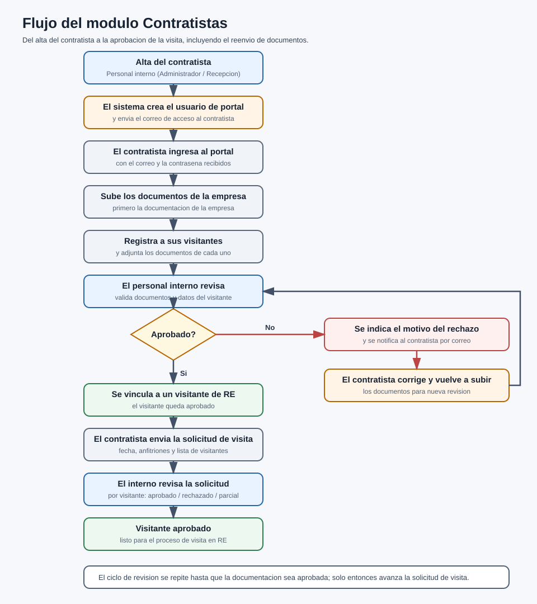

# Documento Funcional / Alcance

## Recepción Electrónica — Módulo Contratistas

Versión 1.0

---

| Campo | Descripción |
| --- | --- |
| Tipo de documento | Documento Funcional / Alcance (módulo opcional) |
| Código | INT-001-DF |
| Módulo | Contratistas |
| Producto base | Recepción Electrónica (RE) |
| Versión | 1.0 |
| Fecha | 2026-06-24 |
| Responsable | Área de Sistemas / Desarrollo |
| Clasificación | Uso interno / Cliente |
| Estado | Vigente |

> Documento autocontenido. Se entrega junto con la base de RE cuando el cliente contrata este módulo. El **Manual de Usuario** de este módulo (INT-001-MU) describe la operación pantalla por pantalla.

---

## Control de versiones

| Versión | Fecha | Autor | Descripción |
| --- | --- | --- | --- |
| 1.0 | 2026-06-24 | Área de Sistemas / Desarrollo | Versión inicial del documento funcional de Contratistas. |

---

## Contenido

1. Qué hace la integración
2. Qué problema resuelve
3. Qué módulos toca
4. Cómo se prende y se apaga
5. Flujo principal
6. Reglas de negocio
7. Dentro y fuera del alcance
8. Errores esperados y casos especiales
9. Control documental

---

## 1. Qué hace la integración

El módulo **Contratistas** habilita un **portal externo** para las empresas contratistas y una pantalla administrativa interna. Con él:

- El personal interno da de alta a cada **empresa contratista**, y el sistema le crea automáticamente un **usuario de portal** (rol Contratista) y le envía su correo de acceso.
- El contratista entra a su **portal** y ahí carga los **documentos de su empresa**, registra a sus **visitantes** (con documentos) y envía **solicitudes de visita**.
- El personal interno **revisa y aprueba/rechaza** los visitantes y las solicitudes. Al aprobar un visitante, este se **vincula** con un visitante de RE.

## 2. Qué problema resuelve

Sin el módulo, recepción tiene que capturar y validar manualmente a todo el personal de las empresas contratistas y su documentación al momento de llegar. Con el módulo:

- El **contratista precarga** a su gente y sus documentos con anticipación.
- Recepción solo **revisa y aprueba**, agilizando el ingreso y reduciendo errores.
- Queda **trazabilidad** de qué se aprobó/rechazó, por quién y con qué motivo.

## 3. Qué módulos toca

| Módulo base | Cómo lo toca |
| --- | --- |
| Configuración | Se activa/desactiva y se definen los documentos requeridos al contratista. |
| Usuarios | Al crear un contratista se genera un **usuario de portal (rol Contratista)**. |
| Visitantes | Al aprobar un visitante del contratista, se **vincula** a un visitante de RE. |
| Correo | Envío del correo de acceso al portal y reenvíos. |
| Catálogos (Empresas) | El contratista se asocia a una empresa de RE. |

## 4. Cómo se prende y se apaga

La integración se controla desde **Configuración → pestaña Integraciones**, con el interruptor:

> **"Portal de Visitas para Contratistas"** — *"Habilita o deshabilita el módulo de contratistas en el sistema."*

| Estado | Qué ocurre |
| --- | --- |
| **Encendido** | Aparecen los menús **Portal Contratistas** (roles Administrador y Contratista) y **Contratistas** (Administrador/Recepción); se habilitan sus pantallas y el portal externo. |
| **Apagado** | Se **ocultan** los menús y se **bloquean** las rutas del módulo. Además, **los usuarios con rol Contratista se desactivan** y se limpia su sesión: dejan de poder entrar al portal. |

**Consideraciones importantes:**

- Bandera técnica: `configuraciones.habilitarContratistas`. De forma predeterminada viene **encendida**.
- El módulo requiere tener **al menos un documento activo** por ámbito (contratista/visitantes); el sistema **no permite** desactivar el último documento requerido.
- La **visibilidad** del interruptor en Configuración depende de que `contratistas` esté incluido en `INTEGRACIONES_VISIBLES` cuando el modo de visibilidad es por cliente.

## 5. Flujo principal

1. El personal interno **da de alta** al contratista. El sistema crea su **usuario de portal** y **envía el correo** de acceso.
2. El contratista ingresa al portal y **completa los documentos** de su empresa.
3. El contratista **registra a sus visitantes** y adjunta sus documentos.
4. El personal interno **valida** cada visitante: aprobado o rechazado (con motivo).
5. El contratista **envía una solicitud de visita** (fecha, anfitriones y lista de visitantes).
6. El personal interno **revisa la solicitud por visitante** y la aprueba o rechaza.
7. El visitante aprobado queda **vinculado a un visitante de RE**, listo para el proceso normal de visita.

**Diagrama 1.** Flujo del módulo Contratistas: del alta del contratista a la aprobación de la visita, incluyendo el reenvío de documentos cuando no se aprueban.

## 6. Reglas de negocio

- Cada contratista tiene **un usuario de portal** (rol Contratista) y su contraseña se guarda cifrada.
- Estados de validación del visitante: **Pendiente**, **Aprobado**, **Rechazado** (con motivo).
- Estados de la solicitud: **Pendiente**, **Aprobado**, **Rechazado**, **Parcial** (cuando unos visitantes se aprueban y otros no).
- Los **documentos requeridos** son configurables por el cliente (obligatorios u opcionales), tanto para la empresa contratista como para sus visitantes.
- Solo el **personal interno** puede validar; el contratista solo captura y consulta.

## 7. Dentro y fuera del alcance

**Dentro del alcance:**

- Alta/edición/estado de contratistas y su usuario de portal.
- Portal: documentos de empresa, visitantes y solicitudes de visita.
- Validación (aprobar/rechazar) de visitantes y solicitudes por el personal interno.
- Configuración de los documentos requeridos.

**Fuera del alcance:**

- El **control de acceso físico** y el registro de entrada/salida (lo hace la base de RE una vez vinculado el visitante).
- La operación normal de la **visita** (bitácora, QR, eventos), que corresponde al producto base.

## 8. Errores esperados y casos especiales

| Situación | Qué pasa / qué hacer |
| --- | --- |
| El contratista no recibió el correo de acceso | Reenviar el correo desde la pantalla de Contratistas; verificar que el correo sea correcto. |
| Se apaga el módulo con contratistas operando | Los usuarios rol Contratista se **desactivan** y pierden acceso al portal; al reactivarlo, revisar su estado. |
| Intento de desactivar el último documento requerido | El sistema **no lo permite**: debe quedar al menos un documento activo por ámbito. |
| Visitante con documentación incompleta | Queda en estado **Pendiente**; el personal interno puede rechazarlo indicando el motivo. |
| Acceso al portal con un rol no autorizado | El sistema **niega** el acceso. |

## 9. Control documental

| Documento | Código | Versión | Fecha | Responsable | Estado |
| --- | --- | --- | --- | --- | --- |
| Documento Funcional / Alcance — Contratistas | INT-001-DF | 1.0 | 2026-06-24 | Área de Sistemas / Desarrollo | Vigente |

**Documentos relacionados:** INT-001-MU (Manual de Usuario), MU-RE-001, DF-RE-001, MA-RE-001.

---

**Fin del documento.**
