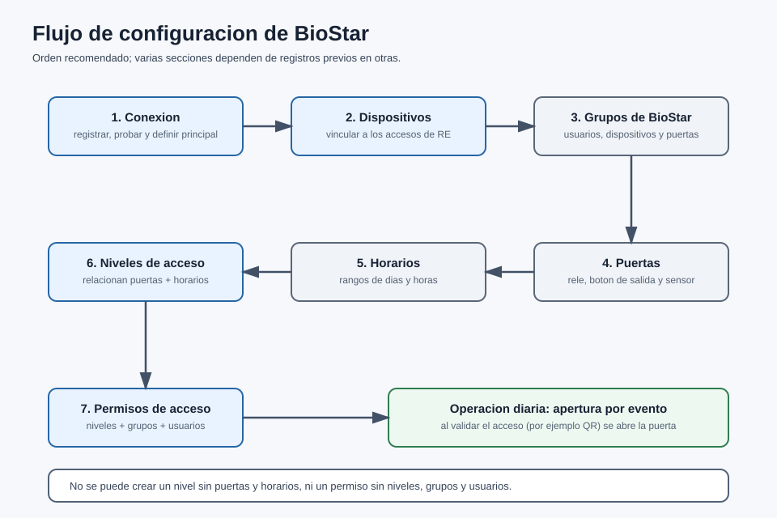

# Documento Funcional / Alcance

## Recepción Electrónica — Módulo BioStar

Versión 1.0

---

| Campo | Descripción |
| --- | --- |
| Tipo de documento | Documento Funcional / Alcance (módulo opcional) |
| Código | INT-002-DF |
| Módulo | BioStar (Control de Acceso Suprema/BioStar) |
| Producto base | Recepción Electrónica (RE) |
| Versión | 1.0 |
| Fecha | 2026-06-24 |
| Responsable | Área de Sistemas / Desarrollo |
| Clasificación | Uso interno / Cliente |
| Estado | Vigente |

> Documento autocontenido. El **Manual de Usuario** de este módulo (INT-002-MU) describe la operación pantalla por pantalla. Requiere el producto base operativo y una plataforma BioStar del cliente.

---

## Control de versiones

| Versión | Fecha | Autor | Descripción |
| --- | --- | --- | --- |
| 1.0 | 2026-06-24 | Área de Sistemas / Desarrollo | Versión inicial del documento funcional de BioStar. |

---

## Contenido

1. Qué hace la integración
2. Qué problema resuelve
3. Qué módulos toca
4. Cómo se prende y se apaga
5. Flujo principal
6. Reglas de negocio
7. Dentro y fuera del alcance
8. Errores esperados y casos especiales
9. Control documental

---

## 1. Qué hace la integración

El módulo **BioStar** conecta Recepción Electrónica con la plataforma de control de acceso **Suprema/BioStar** para:

- Configurar una **conexión** al servidor BioStar y administrar sus **dispositivos** (lectores/controladoras).
- Administrar catálogos de BioStar: **grupos de dispositivos, niveles de acceso, permisos (grupos de acceso), horarios, grupos de puertas y puertas de acceso**.
- Administrar **grupos de usuarios** de BioStar y sincronizar **empleados** hacia la plataforma.
- **Abrir (y cerrar) puertas** automáticamente cuando un visitante o empleado valida su acceso en RE.

## 2. Qué problema resuelve

Permite que la validación de acceso en RE (por ejemplo, un QR en recepción) **accione físicamente la puerta** a través de BioStar, en lugar de operar la puerta por separado. Centraliza en RE la administración de dispositivos, puertas y permisos, y mantiene a los empleados sincronizados con el control de acceso, evitando en muchos casos entrar directamente a la plataforma BioStar.

## 3. Qué módulos toca

| Módulo base | Cómo lo toca |
| --- | --- |
| Configuración | Se activa/desactiva la integración. |
| Control de acceso / Eventos | Al validar un evento, se dispara la **apertura de puerta** en BioStar. |
| Catálogos (Accesos) | Cada dispositivo/puerta se vincula a un **acceso** de RE. |
| Empleados | Se sincronizan hacia BioStar (identificador y grupo). |
| Escáner QR / Kiosco (rol Tablet) | La operación por tablet depende de esta integración. |

## 4. Cómo se prende y se apaga

Se controla desde **Configuración → pestaña Integraciones**, con el interruptor:

> **"Integración con Suprema / BioStar"** — *"Esta opción habilita el uso de la integración con dispositivos Suprema/BioStar."*

| Estado | Qué ocurre |
| --- | --- |
| **Encendido** | Aparece la sección **BioStar** (Conexión, Dispositivos, Puertas, Niveles, Horarios, Grupos, Permisos), disponible para el rol Administrador. Se habilita la apertura de puertas por evento. |
| **Apagado** | Se **ocultan** los menús y **se bloquean** las rutas de BioStar. Además, **los usuarios con rol Tablet (escáner QR/kiosco) se desactivan** y se limpia su sesión. |

**Consideraciones importantes:**

- Bandera técnica: `configuraciones.habilitarIntegracionBiostar`.
- Todas las funciones del módulo requieren **rol Administrador (Super Admin)**.
- La **visibilidad** del interruptor depende de que `biostar` esté incluido en `INTEGRACIONES_VISIBLES` cuando el modo de visibilidad es por cliente.
- Variables de entorno de apoyo: `BIOSTAR_PORT` (por defecto 443) y `BIOSTAR_DEBUG`. No se documentan valores reales.

## 5. Flujo principal

**Configuración inicial (orden recomendado):**

1. **Conexión:** configurar y **probar** la conexión al servidor BioStar; definir el dispositivo **principal**.
2. **Dispositivos:** consultar/registrar los dispositivos y vincularlos a los **accesos** de RE.
3. **Grupos:** crear grupos de usuarios, de dispositivos y de puertas.
4. **Puertas:** registrar las puertas y asociarlas a dispositivos y grupos.
5. **Horarios:** crear los rangos de acceso.
6. **Niveles de acceso:** relacionar puertas con horarios (reglas).
7. **Permisos:** integrar niveles de acceso, grupos de usuarios y usuarios.

**Operación (apertura por evento):**

1. Un visitante/empleado **valida su acceso** en RE (por ejemplo, por QR).
2. RE identifica el **acceso** y verifica si tiene apertura BioStar habilitada.
3. El módulo localiza el **dispositivo** y la **puerta** destino, resuelve la conexión activa y envía la orden de **apertura**.
4. En **modo pulso**, la puerta se **cierra automáticamente** tras el tiempo configurado; en **modo manual**, permanece abierta hasta una orden de cierre.

**Diagrama 1.** Orden recomendado de configuración de BioStar y la operación de apertura por evento.

## 6. Reglas de negocio

- La **sesión** con BioStar se reutiliza mientras es válida y se **renueva automáticamente** al expirar.
- Las **contraseñas** de conexión y dispositivos se guardan **cifradas** y solo se descifran para el formulario de edición; las respuestas de listado **no** exponen contraseñas ni el identificador de sesión.
- La apertura aplica una **ventana anti-rebote** para evitar aperturas repetidas en pocos segundos.
- Solo puede haber **un dispositivo principal (main)** por estado; se usa preferentemente para las operaciones de apertura.
- Modo de apertura: **pulso** (cierre automático, 1–30 s, por defecto 3 s) o **manual** (cierre por orden).
- Varias secciones **dependen de registros previos**: no se puede crear un nivel de acceso sin puertas y horarios, ni un permiso sin niveles, grupos y usuarios.

## 7. Dentro y fuera del alcance

**Dentro del alcance:**

- Conexión, dispositivos, catálogos (niveles, permisos, horarios, puertas, grupos) y grupos de usuarios de BioStar.
- Apertura/cierre de puertas vinculada a accesos y eventos de RE.
- Sincronización de empleados hacia BioStar.

**Fuera del alcance:**

- La **operación interna** y el **licenciamiento** de la plataforma BioStar (responsabilidad del proveedor/instalación del cliente).
- La red física, cableado y puesta a punto de los lectores/controladoras.

## 8. Errores esperados y casos especiales

| Situación | Qué pasa / qué hacer |
| --- | --- |
| No hay conexión registrada o no se pudo iniciar sesión | Al entrar a otras secciones, el sistema muestra **"No se pudo consultar"** e invita a ir a Configuración; registre/pruebe la conexión. |
| Credenciales inválidas al probar conexión | Error controlado, **sin exponer** datos sensibles; corregir credenciales. |
| La puerta no abre al validar | Revisar que el acceso tenga apertura habilitada, el dispositivo/puerta destino y la conexión activa. |
| Se apaga la integración con tablets operando | Los usuarios rol **Tablet** se **desactivan**; al reactivar, revisar su estado. |
| Aperturas repetidas en segundos | La **ventana anti-rebote** las evita; es comportamiento esperado. |
| Sesión expirada | El módulo **re-inicia sesión** automáticamente. |
| "Borrar y subir de nuevo" tarda | Es normal: **recarga** la configuración del dispositivo y puede tomar algunos minutos. |

## 9. Control documental

| Documento | Código | Versión | Fecha | Responsable | Estado |
| --- | --- | --- | --- | --- | --- |
| Documento Funcional / Alcance — BioStar | INT-002-DF | 1.0 | 2026-06-24 | Área de Sistemas / Desarrollo | Vigente |

**Documentos relacionados:** INT-002-MU (Manual de Usuario), MU-RE-001, DF-RE-001, MA-RE-001, MI-RE-001.

---

**Fin del documento.**
