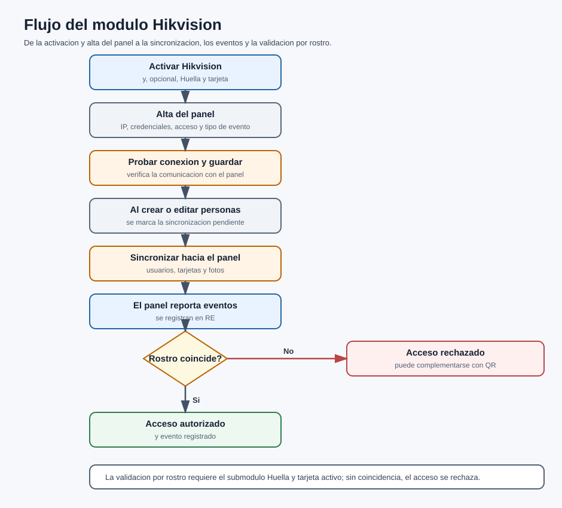

# Documento Funcional / Alcance

## Recepción Electrónica — Módulo Hikvision

Versión 1.0

---

| Campo | Descripción |
| --- | --- |
| Tipo de documento | Documento Funcional / Alcance (módulo opcional) |
| Código | INT-003-DF |
| Módulo | Hikvision + submódulo Huella y Tarjeta |
| Producto base | Recepción Electrónica (RE) |
| Versión | 1.0 |
| Fecha | 2026-06-24 |
| Responsable | Área de Sistemas / Desarrollo |
| Clasificación | Uso interno / Cliente |
| Estado | Vigente |

> Documento autocontenido. El submódulo **Huella y Tarjeta** (`hikvision_biometria`) **depende** de que la integración Hikvision esté habilitada. El **Manual de Usuario** (INT-003-MU) describe la operación pantalla por pantalla.

---

## Control de versiones

| Versión | Fecha | Autor | Descripción |
| --- | --- | --- | --- |
| 1.0 | 2026-06-24 | Área de Sistemas / Desarrollo | Versión inicial del documento funcional de Hikvision. |

---

## Contenido

1. Qué hace la integración
2. Qué problema resuelve
3. Qué módulos toca
4. Cómo se prende y se apaga
5. Flujo principal
6. Reglas de negocio
7. Dentro y fuera del alcance
8. Errores esperados y casos especiales
9. Control documental

---

## 1. Qué hace la integración

El módulo **Hikvision** conecta Recepción Electrónica con **paneles Hikvision de control de acceso** (dispositivos de reconocimiento facial) para:

- Administrar **paneles** y **cámaras**.
- **Sincronizar** visitantes/empleados, citas, tarjetas y fotos hacia los paneles.
- **Recibir y registrar** los eventos de acceso que reportan los paneles.
- Con el submódulo **Huella y Tarjeta**, activar funciones **biométricas y de tarjeta** usando un **panel maestro**, incluyendo la **validación de acceso por rostro**.

## 2. Qué problema resuelve

Automatiza que las personas registradas en RE queden **cargadas en los paneles Hikvision** (con su foto/tarjeta), y que los **accesos ocurridos en los paneles se reflejen en RE**. Así, la operación de control de acceso físico y el registro en RE quedan sincronizados sin captura manual.

## 3. Qué módulos toca

| Módulo base | Cómo lo toca |
| --- | --- |
| Configuración | Se activa/desactiva la integración y su submódulo. |
| Control de acceso / Eventos | Recibe eventos de los paneles y permite **validación por rostro**. |
| Catálogos (Accesos) | Cada panel se vincula a un **acceso** de RE. |
| Empleados / Visitantes | Se sincronizan hacia los paneles (usuarios, tarjetas, fotos). |

## 4. Cómo se prende y se apaga

Se controla desde **Configuración → pestaña Integraciones**, con **dos interruptores** (uno depende del otro):

> **"Integración con Control de accesos de Hikvision"** — *"Esta opción habilita el uso de los dispositivos de reconocimiento facial de la marca Hikvision."*
>
> **"Huella y tarjeta (Hikvision)"** (submódulo) — *"Activa funciones biométricas y de tarjeta. Esta opción habilita el uso de panel maestro para operaciones de huella/tarjeta."*

| Interruptor | Estado | Qué ocurre |
| --- | --- | --- |
| Hikvision | Encendido | Aparece **Dispositivos → Hikvision** (rol Administrador) y se habilita la sincronización con paneles. |
| Hikvision | Apagado | Se ocultan sus menús/rutas. **Además, el submódulo "Huella y tarjeta" se apaga automáticamente.** |
| Huella y tarjeta | Encendido | Solo disponible si Hikvision está encendido. Habilita funciones biométricas/tarjeta y el **panel maestro**. |
| Huella y tarjeta | Apagado | Se desactivan esas funciones y se **restablece** la marca de panel maestro de los dispositivos. |

**Consideraciones importantes:**

- Banderas técnicas: `configuraciones.habilitarIntegracionHv` y `configuraciones.habilitarIntegracionHvBiometria`. Existe además `habilitarCamaras` para la sección de cámaras.
- **Dependencia:** "Huella y tarjeta" **no puede** encenderse si Hikvision está apagado; y si apaga Hikvision, el submódulo se apaga solo.
- La **visibilidad** de los interruptores depende de que `hikvision` y/o `hikvision_biometria` estén en `INTEGRACIONES_VISIBLES` cuando el modo de visibilidad es por cliente.
- La gestión de paneles requiere **rol Administrador**.

## 5. Flujo principal

**Configuración:**

1. Se da de alta el **panel** con su IP, credenciales, acceso y tipo de evento, y se **prueba la conexión**.
2. Al crear/editar visitantes/empleados, el sistema marca la **sincronización pendiente**.
3. El sistema (o los procesos auxiliares) **sincroniza** usuarios, tarjetas y fotos hacia el panel.

**Operación:**

1. El panel **reporta eventos** de acceso, que se **registran en RE**.
2. Con el submódulo activo, en el punto de acceso se **captura el rostro** y se valida contra los datos almacenados; si coincide, se autoriza y se registra el evento.

**Diagrama 1.** Flujo de Hikvision: activación, alta y prueba del panel, sincronización de personas, eventos y validación por rostro.

## 6. Reglas de negocio

- Las **credenciales** de paneles/cámaras se guardan **cifradas** y no se exponen en las respuestas.
- Los datos biométricos se manejan como **datos personales sensibles**, con acceso restringido (alineado con PSI.05 — Enmascaramiento).
- La validación por rostro usa un **umbral de similitud**; puede complementarse con QR.
- El sistema controla el **desfase de reloj** de los paneles y puede **alertar** cuando supera un umbral.
- Solo el rol **Administrador** administra paneles y cámaras.

## 7. Dentro y fuera del alcance

**Dentro del alcance:**

- Administración de paneles y cámaras.
- Sincronización de personas, tarjetas, fotos y citas hacia los paneles.
- Recepción/registro de eventos y **validación por rostro** (submódulo).

**Fuera del alcance:**

- La **instalación física** y el **firmware/licenciamiento** de los paneles Hikvision (responsabilidad del proveedor/instalación del cliente).
- La red local y el cableado de los dispositivos.

## 8. Errores esperados y casos especiales

| Situación | Qué pasa / qué hacer |
| --- | --- |
| Panel no disponible | La operación base **no se bloquea**; los procesos de sincronización reintentan. |
| "Huella y tarjeta" no se puede activar | Primero debe estar encendida la integración **Hikvision**. |
| Se apaga Hikvision con biometría activa | El submódulo se **apaga automáticamente** y se restablece el panel maestro. |
| Falsos positivos/negativos en rostro | Ajustar el **umbral** y usar validación complementaria (QR). |
| Desfase de reloj en el panel | El sistema **alerta**; sincronizar la hora del panel. |
| Desincronización RE ↔ panel | Usar las banderas de sincronización pendiente y **re-sincronizar**. |

## 9. Control documental

| Documento | Código | Versión | Fecha | Responsable | Estado |
| --- | --- | --- | --- | --- | --- |
| Documento Funcional / Alcance — Hikvision | INT-003-DF | 1.0 | 2026-06-24 | Área de Sistemas / Desarrollo | Vigente |

**Documentos relacionados:** INT-003-MU (Manual de Usuario), MU-RE-001, DF-RE-001, MA-RE-001, MI-RE-001, IA-RE-001.

---

**Fin del documento.**
