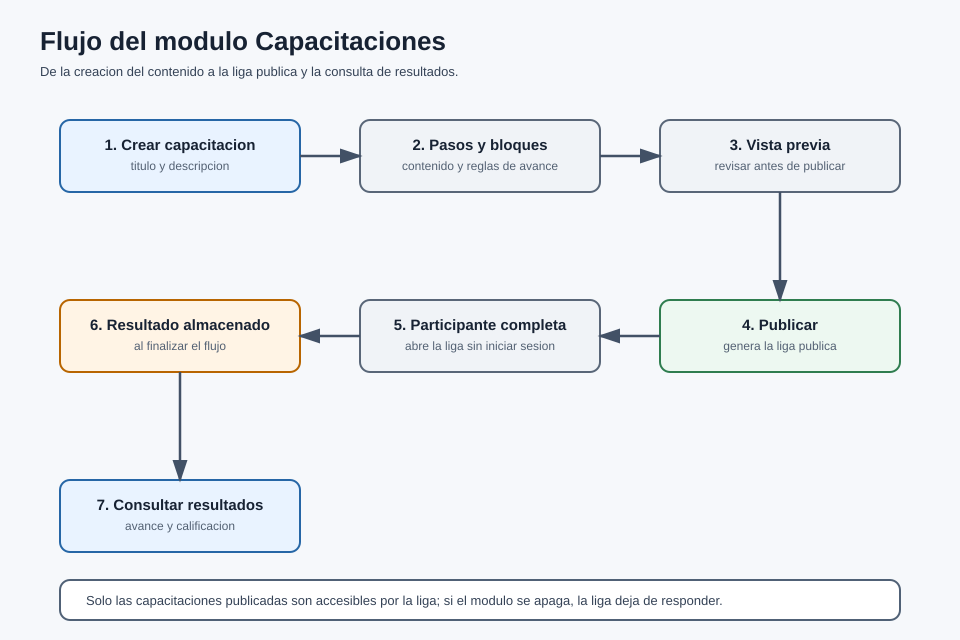

# Manual de Usuario

## Recepción Electrónica — Módulo Capacitaciones Públicas

Versión 1.0

---

| Campo | Descripción |
| --- | --- |
| Tipo de documento | Manual de Usuario (módulo opcional) |
| Código | INT-004-MU |
| Módulo | Capacitaciones Públicas |
| Producto base | Recepción Electrónica (RE) |
| Versión | 1.0 |
| Fecha | 2026-06-24 |
| Responsable | Área de Sistemas / Desarrollo |
| Clasificación | Uso interno / Cliente |
| Estado | Vigente |

> Este manual describe la operación del módulo Capacitaciones pantalla por pantalla. El **alcance funcional** se describe en el documento INT-004-DF.

---

## Control de versiones

| Versión | Fecha | Autor | Descripción |
| --- | --- | --- | --- |
| 1.0 | 2026-06-24 | Área de Sistemas / Desarrollo | Versión inicial del manual de usuario de Capacitaciones. |

---

## Contenido

1. Introducción
2. Objetivo
3. Alcance
4. Perfiles de usuario
5. Descripción general del módulo
6. Cómo activar el módulo (Configuración)
7. Listado de capacitaciones
8. Crear una capacitación
   - 8.1 Datos generales
   - 8.2 Pasos y bloques
   - 8.3 Reglas de avance
9. Vista previa
10. Publicar y compartir la liga
11. Vista pública (participante)
12. Resultados
13. Preguntas o incidencias comunes
14. Glosario
15. Control documental

---

## Contenido de imágenes

- Ilustración 1. Interruptor "Capacitaciones públicas" en Configuración
- Ilustración 2. Menú de Capacitaciones
- Ilustración 3. Listado de capacitaciones
- Ilustración 4. Datos generales de la capacitación
- Ilustración 5. Editor de pasos y bloques
- Ilustración 6. Reglas de avance de un paso
- Ilustración 7. Vista previa de la capacitación
- Ilustración 8. Publicación y liga pública
- Ilustración 9. Vista pública (participante)
- Ilustración 10. Resultados de la capacitación

---

## 1. Introducción

El presente manual describe el uso del módulo **Capacitaciones** dentro del sistema de **Recepción Electrónica (RE)**. Este módulo permite crear cursos guiados por **pasos** y **bloques** de contenido, **publicarlos** mediante una **liga pública** que se abre sin iniciar sesión, y **registrar** los resultados de los participantes.

## 2. Objetivo

Describir, paso a paso, cómo crear, previsualizar, publicar y compartir una capacitación, cómo la completa un participante y cómo consultar los resultados.

## 3. Alcance

Este manual comprende únicamente el módulo **Capacitaciones**: creación de contenido, publicación por liga y consulta de resultados. No incluye otros módulos del sistema.

## 4. Perfiles de usuario

| Perfil | Qué puede hacer |
| --- | --- |
| Administrador | Activar el módulo, crear/editar/publicar capacitaciones y consultar resultados. |
| Recepción | Crear/editar/publicar capacitaciones y consultar resultados. |
| Participante (público) | Abrir la liga sin login y completar la capacitación. |

## 5. Descripción general del módulo

Una capacitación se organiza en **pasos**; cada paso contiene **bloques** (texto, imagen, video, pregunta, checklist, etc.). La capacitación pasa por los estados **borrador → publicada → inactiva**. Solo cuando está **publicada** puede abrirse mediante su **liga pública**. Al finalizar, el sistema guarda el **resultado** del participante.

## 6. Cómo activar el módulo (Configuración)

**Paso 1.** Con rol **Administrador**, entre a **Configuración → pestaña Integraciones**.

`[Foto: interruptor "Capacitaciones públicas" en Configuración]`

**Ilustración 1.** Interruptor "Capacitaciones públicas" en Configuración

**Paso 2.** Active el interruptor **"Capacitaciones públicas"** y guarde. Aparece el menú **Capacitaciones**.

`[Foto: menú de Capacitaciones]`

**Ilustración 2.** Menú de Capacitaciones

> **Nota:** Si el módulo está **apagado**, las ligas públicas responden con un error (no encontrado).

## 7. Listado de capacitaciones

La pantalla **Capacitaciones** (`/capacitaciones`) muestra las capacitaciones por estado.

`[Foto: listado de capacitaciones]`

**Ilustración 3.** Listado de capacitaciones

| N. | Campo | Descripción |
| --- | --- | --- |
| 1 | Filtro por estado | Borrador, publicada o inactiva. |
| 2 | Buscar | Localiza una capacitación por título. |
| 3 | Nueva | Abre el editor para crear una capacitación. |
| 4 | Tabla | Muestra título, estado y acciones. |

**Acciones que tiene el módulo Capacitaciones:**

- **Editar:** abre el editor de la capacitación.
- **Vista previa:** previsualiza la capacitación.
- **Duplicar:** crea una copia.
- **Cambiar estado:** borrador / publicada / inactiva.
- **Resultados:** consulta los resultados.
- **Eliminar:** elimina la capacitación.

## 8. Crear una capacitación

### 8.1 Datos generales

**Paso 1.** En **Capacitaciones**, presione **Nueva**.

`[Foto: datos generales de la capacitación]`

**Ilustración 4.** Datos generales de la capacitación

**Paso 2.** Capture los datos generales:

| Campo | Obligatorio | Descripción |
| --- | --- | --- |
| Título \* | Sí | Nombre de la capacitación. |
| Descripción | No | Breve descripción. |
| Presentación (color, logo, portada) | No | Personalización visual. |
| Configuración | No | Barra de progreso, navegación, requerir identificación, permitir anónimo, etc. |

### 8.2 Pasos y bloques

`[Foto: editor de pasos y bloques]`

**Ilustración 5.** Editor de pasos y bloques

- Agregue **pasos** y, dentro de cada paso, **bloques** de contenido.
- Tipos de bloque: **identificación, texto, imagen, video, link, checklist, tarjetas, acordeón, pregunta, separador, documento y aviso**.
- Ordene los pasos y bloques según el recorrido deseado.

### 8.3 Reglas de avance

`[Foto: reglas de avance de un paso]`

**Ilustración 6.** Reglas de avance de un paso

Cada paso puede tener **reglas de avance** que condicionan cuándo el participante puede continuar:

| Regla | Descripción |
| --- | --- |
| Tiempo mínimo | Segundos mínimos antes de avanzar. |
| Ver bloques | Exige revisar ciertos bloques. |
| Responder preguntas | Exige contestar las preguntas del paso. |
| Confirmación requerida | Solicita una confirmación para avanzar. |

## 9. Vista previa

Antes de publicar, use **Vista previa** para revisar cómo se verá la capacitación.

`[Foto: vista previa de la capacitación]`

**Ilustración 7.** Vista previa de la capacitación

## 10. Publicar y compartir la liga

**Paso 1.** Cambie el estado a **Publicada**. El sistema genera la **liga pública** (slug).

`[Foto: publicación y liga pública]`

**Ilustración 8.** Publicación y liga pública

**Paso 2.** Copie y **comparta la liga** con los participantes.

> **Nota:** Solo las capacitaciones **publicadas** son accesibles por la liga. Si cambia a **inactiva** o apaga el módulo, la liga deja de responder.

## 11. Vista pública (participante)

`[Foto: vista pública (participante)]`

**Ilustración 9.** Vista pública (participante)

1. El participante abre la **liga pública** (sin iniciar sesión).
2. Completa los pasos respetando las **reglas de avance**.
3. Al finalizar, el **resultado se envía** y se almacena.

## 12. Resultados

En **Resultados** (`/capacitaciones/:id/resultados`), el administrador consulta quién completó la capacitación y su avance/calificación.

`[Foto: resultados de la capacitación]`

**Ilustración 10.** Resultados de la capacitación

**Diagrama 1.** Flujo de Capacitaciones: de la creación del contenido a la liga pública y la consulta de resultados.

## 13. Preguntas o incidencias comunes

**1. No aparece el menú Capacitaciones**
*Acción:* verifique que el interruptor **"Capacitaciones públicas"** esté encendido.

**2. La liga pública da error / no encontrado**
*Acción:* confirme que el módulo esté encendido y que la capacitación esté **publicada**.

**3. No se guardan los resultados**
*Acción:* confirme que el participante **finalizó** el flujo y que la capacitación esté publicada.

**4. El participante no puede avanzar**
*Acción:* revise las **reglas de avance** del paso (tiempo mínimo, preguntas, etc.).

**5. Se solicita demasiada información al participante**
*Acción:* ajuste la configuración para **minimizar** datos o permitir participación **anónima**.

## 14. Glosario

**Capacitación.** Curso guiado organizado en pasos y bloques.

**Paso.** Sección de la capacitación que agrupa bloques y reglas de avance.

**Bloque.** Elemento de contenido dentro de un paso (texto, imagen, video, pregunta, etc.).

**Regla de avance.** Condición que el participante debe cumplir para continuar (tiempo, preguntas, etc.).

**Liga pública (slug).** Enlace que abre la capacitación publicada sin iniciar sesión.

**Resultado.** Registro del avance/calificación del participante que completó la capacitación.

**Estado.** Situación de la capacitación: borrador, publicada o inactiva.

## 15. Control documental

| Documento | Código | Versión | Fecha | Responsable | Estado |
| --- | --- | --- | --- | --- | --- |
| Manual de Usuario — Capacitaciones | INT-004-MU | 1.0 | 2026-06-24 | Área de Sistemas / Desarrollo | Vigente |

**Documentos relacionados:** INT-004-DF (Documento Funcional), MU-RE-001, MA-RE-001.

---

**Fin del documento.**
