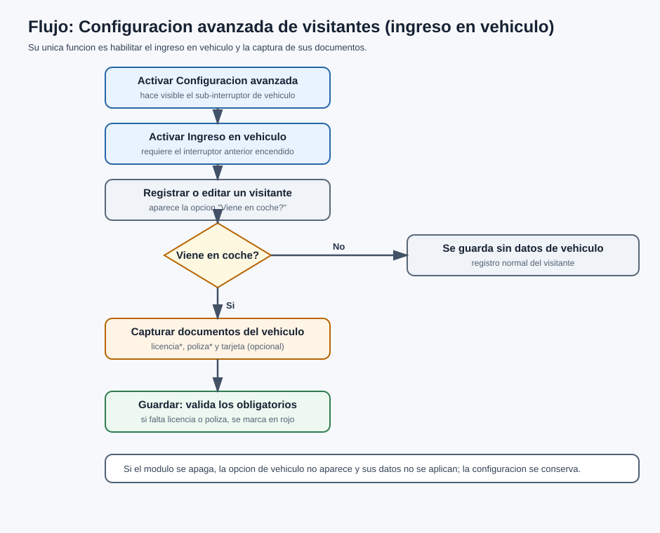

# Manual de Usuario

## Recepción Electrónica — Módulo Configuración Avanzada de Visitantes (Ingreso en Vehículo)

Versión 1.0

---

| Campo | Descripción |
| --- | --- |
| Tipo de documento | Manual de Usuario (módulo opcional) |
| Código | INT-005-MU |
| Módulo | Configuración avanzada de visitantes — Ingreso en vehículo |
| Producto base | Recepción Electrónica (RE) |
| Versión | 1.0 |
| Fecha | 2026-06-24 |
| Responsable | Área de Sistemas / Desarrollo |
| Clasificación | Uso interno / Cliente |
| Estado | Vigente |

> Este manual describe la operación del módulo pantalla por pantalla. El **alcance funcional** se describe en el documento INT-005-DF.

---

## Control de versiones

| Versión | Fecha | Autor | Descripción |
| --- | --- | --- | --- |
| 1.0 | 2026-06-24 | Área de Sistemas / Desarrollo | Versión inicial. Alcance limitado al ingreso en vehículo de visitantes, verificado en código. |

---

## Contenido

1. Introducción
2. Objetivo
3. Alcance
4. Perfiles de usuario
5. Descripción general del módulo
6. Cómo activar el módulo (Configuración)
7. Registrar un visitante con ingreso en vehículo
8. Documentos del vehículo
9. Qué revisar si algo falla
10. Preguntas o incidencias comunes
11. Glosario
12. Control documental

---

## Contenido de imágenes

- Ilustración 1. Interruptores "Configuración avanzada de visitantes" e "Ingreso en vehículo"
- Ilustración 2. Opción "¿Viene en coche?" en el registro del visitante
- Ilustración 3. Captura de los documentos del vehículo
- Ilustración 4. Validación de documentos obligatorios del vehículo

---

## 1. Introducción

El presente manual describe el uso del módulo **Configuración avanzada de visitantes**, cuya función es habilitar, de forma opcional, el **ingreso en vehículo** de los visitantes dentro del sistema de **Recepción Electrónica (RE)**: permite indicar que un visitante llega en coche y **capturar los documentos del vehículo**.

> **Importante.** Las funciones de **OCR de INE**, **autorización por QR**, **verificación**, **bloqueo/desbloqueo**, **programación masiva**, **reversión** y **re-sincronización** de visitantes **son parte de la base** y se describen en el Manual de Usuario del producto base (MU-RE-001). Este módulo **no** las controla.

## 2. Objetivo

Describir, paso a paso, cómo activar el ingreso en vehículo y cómo capturar los documentos del vehículo de un visitante.

## 3. Alcance

Este manual comprende únicamente la función de **ingreso en vehículo** de visitantes. El registro base del visitante y su ciclo de visita se describen en MU-RE-001.

## 4. Perfiles de usuario

| Perfil | Qué puede hacer |
| --- | --- |
| Administrador | Activar el módulo y sus interruptores en Configuración. |
| Recepción | Registrar/editar visitantes marcando el ingreso en vehículo y adjuntando sus documentos. |

## 5. Descripción general del módulo

El módulo se compone de **dos interruptores** en Configuración: **"Configuración avanzada de visitantes"** (padre) y **"Ingreso en vehículo"** (que solo aparece si el padre está encendido). Con ambos activos, el formulario de registro/edición del visitante muestra la opción **"¿Viene en coche?"** y, al marcarla, la **captura de los documentos del vehículo**.

## 6. Cómo activar el módulo (Configuración)

**Paso 1.** Con rol **Administrador**, entre a **Configuración → pestaña Integraciones**.

`[Foto: interruptores "Configuración avanzada de visitantes" e "Ingreso en vehículo"]`

**Ilustración 1.** Interruptores "Configuración avanzada de visitantes" e "Ingreso en vehículo"

**Paso 2.** Encienda **"Configuración avanzada de visitantes"**.

**Paso 3.** Encienda **"Ingreso en vehículo"** (solo aparece si el padre está encendido). Guarde.

> **Nota:** Si apaga el módulo, la opción de vehículo **deja de aparecer** en el registro y sus datos **no se aplican**, aunque la configuración se conserva.

## 7. Registrar un visitante con ingreso en vehículo

**Paso 1.** Registre o edite un visitante como de costumbre (ver MU-RE-001).

**Paso 2.** En el formulario, marque la opción **"¿Viene en coche?"**.

`[Foto: opción "¿Viene en coche?" en el registro del visitante]`

**Ilustración 2.** Opción "¿Viene en coche?" en el registro del visitante

**Paso 3.** Adjunte los **documentos del vehículo** (ver sección 8).

**Paso 4.** Presione **Crear / Guardar**. El sistema valida los documentos requeridos.

## 8. Documentos del vehículo

`[Foto: captura de los documentos del vehículo]`

**Ilustración 3.** Captura de los documentos del vehículo

| Documento | Obligatorio | Descripción |
| --- | --- | --- |
| Licencia de conducir | Sí | Requerida cuando el visitante viene en coche. |
| Póliza de seguro | Sí | Requerida cuando el visitante viene en coche. |
| Tarjeta de circulación | No | Opcional. |

`[Foto: validación de documentos obligatorios del vehículo]`

**Ilustración 4.** Validación de documentos obligatorios del vehículo

> **Validación.** Si marca "¿Viene en coche?" y falta la **licencia** o la **póliza**, el sistema **no guarda** y **resalta en rojo** el documento faltante. Adjúntelo y vuelva a guardar.

**Diagrama 1.** Ingreso en vehículo: activar los interruptores, marcar "¿Viene en coche?" y capturar/validar los documentos del vehículo.

## 9. Qué revisar si algo falla

| Síntoma | Revisar |
| --- | --- |
| No aparece "Ingreso en vehículo" en Configuración | Encender primero **"Configuración avanzada de visitantes"**. |
| No aparece "¿Viene en coche?" en el registro | Que **ambos** interruptores estén encendidos. |
| No guarda al marcar el vehículo | Adjuntar la **licencia** y la **póliza** (obligatorias); el sistema las marca en rojo si faltan. |
| Capturé el vehículo pero no se guardó | Confirmar que el módulo esté encendido; apagado, los datos de vehículo se ignoran. |

## 10. Preguntas o incidencias comunes

**1. ¿Este módulo hace más que el ingreso en vehículo?**
*Respuesta:* No. Hoy su único efecto es habilitar la captura del **ingreso en vehículo** y sus documentos. El OCR, QR, verificación, bloqueo, programación, reversión y re-sincronización son de la **base**.

**2. Activé el módulo pero no veo cambios en el registro**
*Acción:* confirme que también esté encendido **"Ingreso en vehículo"** y marque **"¿Viene en coche?"** en el visitante.

**3. ¿Se pierden mis opciones si apago el módulo?**
*Respuesta:* No. La configuración **se conserva**; solo deja de aplicarse hasta que lo reactive.

## 11. Glosario

**Configuración avanzada de visitantes.** Interruptor que habilita (y hace visible) la opción de ingreso en vehículo.

**Ingreso en vehículo.** Opción que permite registrar que el visitante llega en coche y capturar los documentos del vehículo.

**¿Viene en coche?** Casilla del registro del visitante que activa la captura de documentos del vehículo.

**Documentos del vehículo.** Licencia de conducir y póliza de seguro (obligatorias) y tarjeta de circulación (opcional).

## 12. Control documental

| Documento | Código | Versión | Fecha | Responsable | Estado |
| --- | --- | --- | --- | --- | --- |
| Manual de Usuario — Configuración avanzada de visitantes | INT-005-MU | 1.0 | 2026-06-24 | Área de Sistemas / Desarrollo | Vigente |

**Documentos relacionados:** INT-005-DF (Documento Funcional), MU-RE-001, MA-RE-001.

---

**Fin del documento.**
