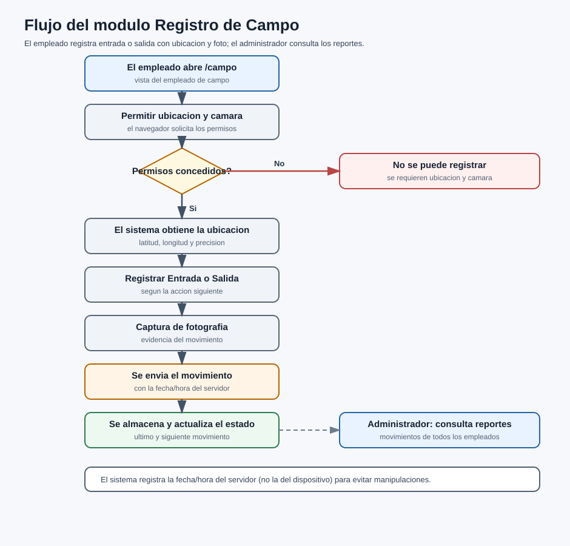

# Manual de Usuario

## Recepción Electrónica — Módulo Registro de Campo

Versión 1.0

---

| Campo | Descripción |
| --- | --- |
| Tipo de documento | Manual de Usuario (módulo opcional) |
| Código | INT-006-MU |
| Módulo | Registro de Campo |
| Producto base | Recepción Electrónica (RE) |
| Versión | 1.0 |
| Fecha | 2026-06-24 |
| Responsable | Área de Sistemas / Desarrollo |
| Clasificación | Uso interno / Cliente |
| Estado | Vigente |

> Este manual describe la operación del módulo Registro de Campo pantalla por pantalla. El **alcance funcional** se describe en el documento INT-006-DF.

---

## Control de versiones

| Versión | Fecha | Autor | Descripción |
| --- | --- | --- | --- |
| 1.0 | 2026-06-24 | Área de Sistemas / Desarrollo | Versión inicial del manual de usuario de Registro de Campo. |

---

## Contenido

1. Introducción
2. Objetivo
3. Alcance
4. Perfiles de usuario
5. Descripción general del módulo
6. Cómo activar el módulo (Configuración)
7. Pantalla de Registro de Campo
8. Registrar un movimiento (entrada / salida)
9. Consultar el estado y los registros propios
10. Reportes de campo (administrador)
11. Preguntas o incidencias comunes
12. Glosario
13. Control documental

---

## Contenido de imágenes

- Ilustración 1. Interruptor "Registro de campo para empleados" en Configuración
- Ilustración 2. Menú Registro Campo
- Ilustración 3. Pantalla de Registro de Campo (ubicación y botones)
- Ilustración 4. Permisos de ubicación y cámara del navegador
- Ilustración 5. Captura de fotografía al registrar movimiento
- Ilustración 6. Confirmación del movimiento y estado actualizado
- Ilustración 7. Reporte de movimientos de campo (administrador)

---

## 1. Introducción

El presente manual describe el uso del módulo **Registro de Campo** dentro del sistema de **Recepción Electrónica (RE)**. Este módulo permite a los **empleados de campo** registrar sus movimientos de **entrada** y **salida** desde la web, capturando su **ubicación** y una **fotografía**, y al administrador **consultar los reportes** correspondientes.

## 2. Objetivo

Describir, paso a paso, cómo el empleado de campo registra sus movimientos y cómo el administrador consulta los reportes, de modo que el módulo se use sin dudas.

## 3. Alcance

Este manual comprende únicamente el módulo **Registro de Campo**: la pantalla de registro del empleado y los reportes del administrador. No incluye otros módulos del sistema.

## 4. Perfiles de usuario

| Perfil | Qué puede hacer |
| --- | --- |
| Administrador | Activar el módulo y consultar los reportes de todos los movimientos. |
| Empleado Campo | Registrar sus movimientos de entrada/salida y consultar su estado y sus registros. |

## 5. Descripción general del módulo

El empleado de campo utiliza la pantalla **/campo**, que muestra su **último movimiento**, la **acción siguiente** (entrada o salida), su **ubicación actual** y la **precisión del GPS**, con los botones para registrar. Cada registro guarda la **ubicación**, una **fotografía** y la **fecha/hora del servidor**. El administrador consulta todo desde los **reportes**.

## 6. Cómo activar el módulo (Configuración)

**Paso 1.** Con rol **Administrador**, entre a **Configuración → pestaña Integraciones**.

`[Foto: interruptor "Registro de campo para empleados" en Configuración]`

**Ilustración 1.** Interruptor "Registro de campo para empleados" en Configuración

**Paso 2.** Active el interruptor **"Registro de campo para empleados"** y guarde. Aparece el menú **Registro Campo**.

`[Foto: menú Registro Campo]`

**Ilustración 2.** Menú Registro Campo

> **Nota:** Al **apagar** el módulo, se **desactivan** los usuarios con rol Empleado Campo.

## 7. Pantalla de Registro de Campo

La pantalla **Registro de Campo** (`/campo`) es la vista del empleado de campo.

`[Foto: pantalla de Registro de Campo (ubicación y botones)]`

**Ilustración 3.** Pantalla de Registro de Campo (ubicación y botones)

| N. | Campo | Descripción |
| --- | --- | --- |
| 1 | Nombre del empleado | Identifica al empleado que registra. |
| 2 | Último movimiento | Muestra el último registro (entrada/salida) y su hora. |
| 3 | Acción siguiente | Indica si corresponde registrar entrada o salida. |
| 4 | Ubicación y precisión | Muestra la ubicación actual y la precisión del GPS. |
| 5 | Botones | Registrar Entrada / Registrar Salida. |

## 8. Registrar un movimiento (entrada / salida)

**Paso 1.** El empleado abre **/campo**. El navegador solicita permiso de **ubicación** y **cámara**; debe **permitirlos**.

`[Foto: permisos de ubicación y cámara del navegador]`

**Ilustración 4.** Permisos de ubicación y cámara del navegador

**Paso 2.** El sistema obtiene la **ubicación** (latitud/longitud y precisión).

**Paso 3.** Presione **Registrar Entrada** o **Registrar Salida**, según la acción siguiente que indique la pantalla.

`[Foto: captura de fotografía al registrar movimiento]`

**Ilustración 5.** Captura de fotografía al registrar movimiento

**Paso 4.** Se **captura la fotografía** y se envía el movimiento.

**Paso 5. Confirmación.** El sistema **almacena** el registro y actualiza el estado (último y siguiente movimiento).

`[Foto: confirmación del movimiento y estado actualizado]`

**Ilustración 6.** Confirmación del movimiento y estado actualizado

> **Nota:** El sistema registra la **fecha/hora del servidor** (no la del dispositivo), para evitar manipulaciones.

## 9. Consultar el estado y los registros propios

Desde la misma pantalla, el empleado puede consultar su **estado actual** (último y siguiente movimiento) y la lista de **sus registros**.

## 10. Reportes de campo (administrador)

El administrador consulta, desde los **reportes**, los movimientos de campo de todos los empleados.

`[Foto: reporte de movimientos de campo (administrador)]`

**Ilustración 7.** Reporte de movimientos de campo (administrador)

- El reporte incluye **fecha, tipo (entrada/salida), ubicación y foto** de cada movimiento.
- Los reportes son **solo para el administrador**.

**Diagrama 1.** Flujo de Registro de Campo: apertura de la pantalla, permisos, registro con ubicación y foto, y consulta de reportes.

## 11. Preguntas o incidencias comunes

**1. No aparece el menú Registro Campo**
*Acción:* verifique que el interruptor esté encendido en Configuración.

**2. El empleado de campo no puede entrar**
*Acción:* confirme que el módulo esté **encendido** (al apagarlo se desactiva su usuario) y que su cuenta esté activa.

**3. No se registra el movimiento**
*Acción:* revise que el navegador tenga permitido el acceso a **ubicación** y **cámara**, y que haya cobertura de GPS.

**4. La ubicación es imprecisa**
*Acción:* reintente en un lugar con mejor señal; el sistema guarda la **precisión** del GPS.

**5. No veo los reportes**
*Acción:* los reportes son **solo para el administrador**; verifique su rol.

## 12. Glosario

**Empleado de campo.** Persona que trabaja fuera de las instalaciones y registra sus movimientos por la web.

**Check-in / Check-out.** Registro de entrada (IN) y de salida (OUT).

**Ubicación / GPS.** Coordenadas (latitud, longitud) y precisión capturadas al registrar.

**Fecha/hora del servidor.** Momento oficial del registro, tomado del servidor y no del dispositivo.

**Estado.** Último movimiento del empleado y la acción siguiente que le corresponde.

**Reporte de campo.** Consulta administrativa de todos los movimientos registrados.

## 13. Control documental

| Documento | Código | Versión | Fecha | Responsable | Estado |
| --- | --- | --- | --- | --- | --- |
| Manual de Usuario — Registro de Campo | INT-006-MU | 1.0 | 2026-06-24 | Área de Sistemas / Desarrollo | Vigente |

**Documentos relacionados:** INT-006-DF (Documento Funcional), MU-RE-001, MA-RE-001.

---

**Fin del documento.**
