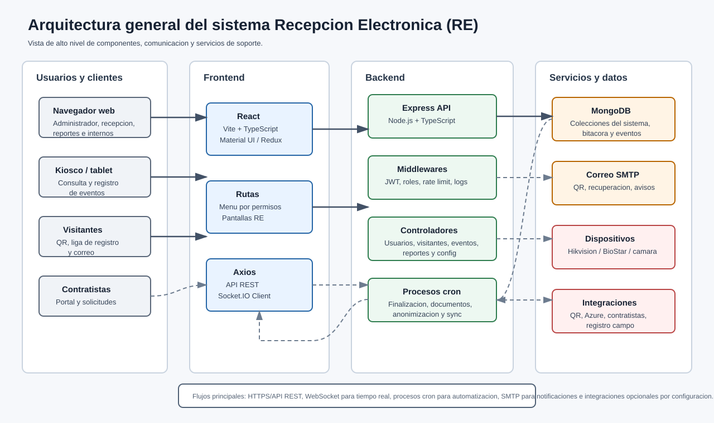

# Manual Técnico

## Recepción Electrónica (RE) — Base

Descripción técnica de la arquitectura, componentes y stack del núcleo de Recepción Electrónica.

| Campo | Descripción |
| --- | --- |
| Tipo de documento | Manual Técnico |
| Código | MT-RE-001 |
| Producto | Recepción Electrónica (RE) — Base |
| Versión | 1.0 |
| Fecha | 2026-06-24 |
| Responsable | Área de Sistemas / Desarrollo |
| Clasificación | Uso interno |
| Estado | Vigente |

---

## Control de versiones

| Versión | Fecha | Autor | Descripción |
| --- | --- | --- | --- |
| 1.0 | 2026-06-24 | Área de Sistemas / Desarrollo | Versión inicial del manual técnico de la base. |

---

## 1. Visión general

RE_PLAY_3 es un sistema web de recepción y control de acceso compuesto por:

- **Frontend** (React + Vite + TypeScript).
- **Backend** (Node.js + Express + TypeScript + MongoDB).
- **Procesos auxiliares** para paneles e integraciones (opcionales).
- **Canal de tiempo real** (WebSocket).

**Ilustración 1.** Diagrama de arquitectura general del sistema.

## 2. Arquitectura

| Capa | Tecnología | Responsabilidad |
| --- | --- | --- |
| Cliente | React, Vite, Material UI, Redux Toolkit, React Router, Axios, React Hook Form + Yup, Socket.IO Client | Interfaz de usuario y consumo de la API. |
| Servidor | Express, TypeScript, Mongoose, JWT, bcrypt, Zod, Socket.IO, express-rate-limit, morgan, express-fileupload, nodemailer | Lógica de negocio, API, autenticación y notificaciones. |
| Datos | MongoDB | Persistencia documental. |

## 3. Frontend (`front/`)

| Carpeta | Propósito |
| --- | --- |
| `src/app` | Store, configuración, constantes, permisos y utilidades globales. |
| `src/app/menus` | Definición del menú principal. |
| `src/components` | Pantallas y componentes funcionales. |
| `src/components/auth` | Login, logout y recuperación. |
| `src/components/catalogos` | Catálogos administrativos y configuración. |
| `src/components/recepcion` | Visitantes, bitácora, reportes, documentos y directorio. |
| `src/components/controlAcceso` | Eventos, escáner QR y operación de acceso. |
| `src/components/kiosco` | Vista de kiosco/tablet. |
| `src/components/setup` | Flujo inicial de configuración. |
| `src/utils` | Utilidades de reportes PDF/Excel. |

Archivos clave: `src/components/Routes.tsx` (rutas) y `src/app/menus/mainMenu.tsx` (menú).

## 4. Backend (`back/`)

| Carpeta | Propósito |
| --- | --- |
| `controllers` | Lógica de negocio por módulo. |
| `routes` | Definición de endpoints Express. |
| `models` | Modelos Mongoose. |
| `middlewares` | Validación de token, logs, rate limit, correo y rutas. |
| `validators` | Validadores compartidos. |
| `cron` | Procesos programados. |
| `handlers` / `realtime` | WebSocket y bus de eventos. |
| `utils` | Correo, cifrado, imágenes, reportes y consultas. |
| `secure` | Certificados/llaves HTTPS (información sensible). |

Archivos principales:

| Archivo | Propósito |
| --- | --- |
| `index.ts` | Conecta a base de datos e inicia el servidor. |
| `server.ts` | Configura Express, CORS, logs, rutas, frontend estático, HTTP/HTTPS y WebSocket. |
| `config.ts` | Carga y valida variables de entorno con Zod. |
| `connection.ts` | Conecta MongoDB e inicializa catálogos base. |

### 4.1 Middlewares

| Middleware | Propósito |
| --- | --- |
| `validarToken.ts` | Valida JWT, usuario activo, roles permitidos y acceso por defecto. |
| `validarTokenWS.ts` | Valida token para WebSocket. |
| `limiters.ts` | Límites de tasa por tipo de ruta. |
| `logRequest.ts` | Registra peticiones HTTP en MongoDB. |
| `log.ts` | Log técnico a archivo. |
| `mail.ts` | Configuración/envío de correos. |

## 5. Seguridad técnica

- Autenticación con JWT y header `x-access-token`.
- Contraseñas con hash (bcrypt).
- Cifrado de credenciales sensibles con `SECRET_CRYPTO`.
- Configuración por variables de entorno (sin secretos en código).
- Rate limiting en rutas de autenticación.
- Soporte HTTP y HTTPS (certificados en `back/secure`).
- Registro de peticiones para trazabilidad.

Alineación con políticas: **PSI.01** (requisitos de seguridad en proyectos), **PSI.05** (control de accesos y enmascaramiento de datos) y **PSI.12** (desarrollo seguro).

## 6. Extensibilidad (módulos opcionales)

El núcleo expone un mecanismo de activación de módulos opcionales por configuración, sin modificar su código:

- Banderas `habilitar*` en la colección `configuraciones`.
- Variables `INTEGRACIONES_VISIBLES` e `INTEGRACIONES_VISIBILIDAD_MODO` para visibilidad por cliente.
- Rutas y menús condicionados en frontend (`Routes.tsx`, `mainMenu.tsx`).

Cada módulo opcional aporta sus propios controladores, rutas, modelos y pantallas, documentados por separado.

## 7. Componentes auxiliares

El repositorio incluye procesos auxiliares (`panel_server`, `demonio_eventos`) y scripts de operación. Su uso depende de los módulos opcionales contratados y se describe en la documentación de integración y de despliegue.

## 8. Control documental

| Documento | Código | Versión | Fecha | Responsable | Estado |
| --- | --- | --- | --- | --- | --- |
| Manual Técnico — RE | MT-RE-001 | 1.0 | 2026-06-24 | Área de Sistemas / Desarrollo | Vigente |
